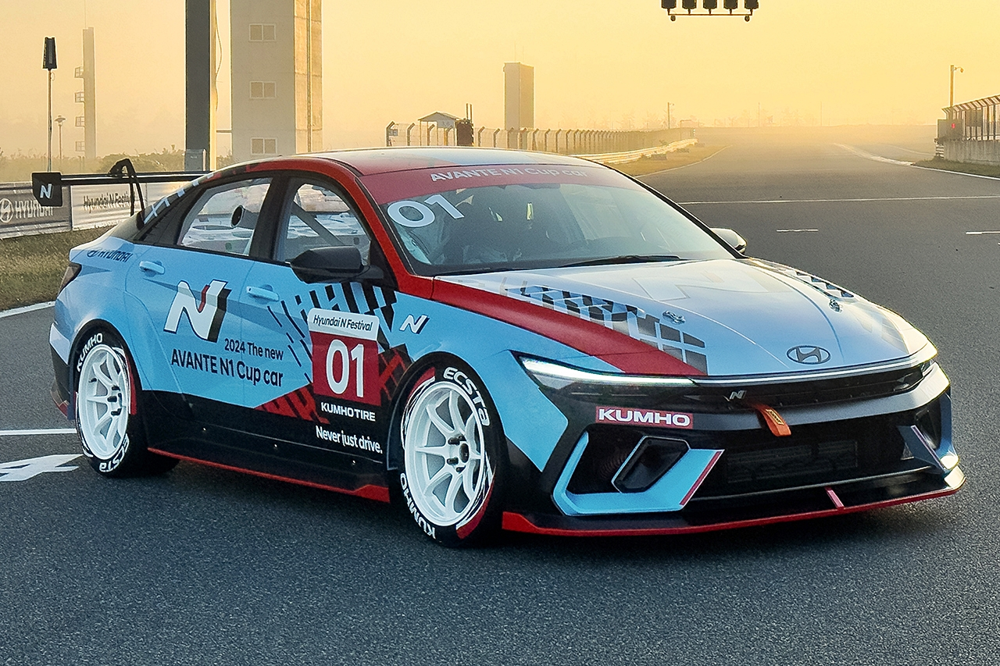
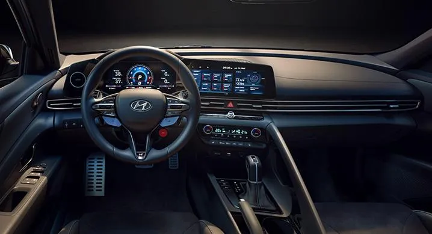
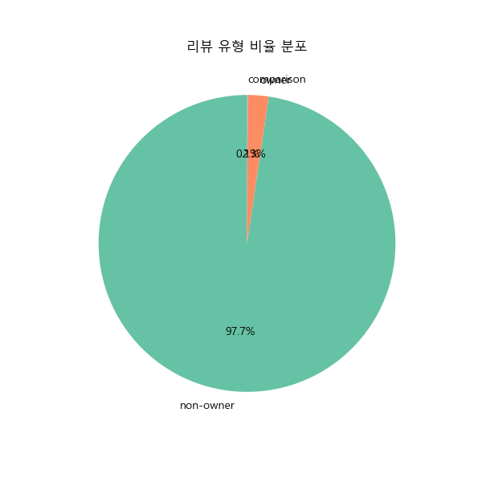
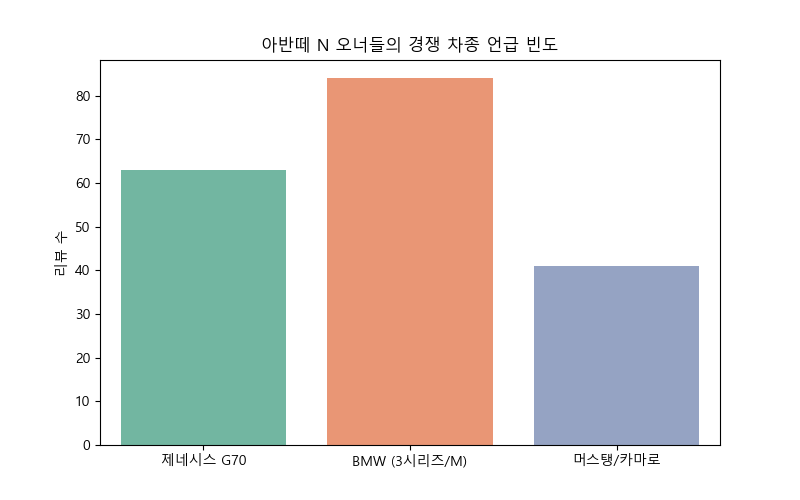
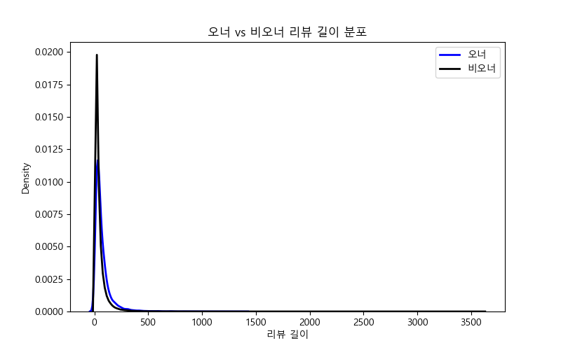
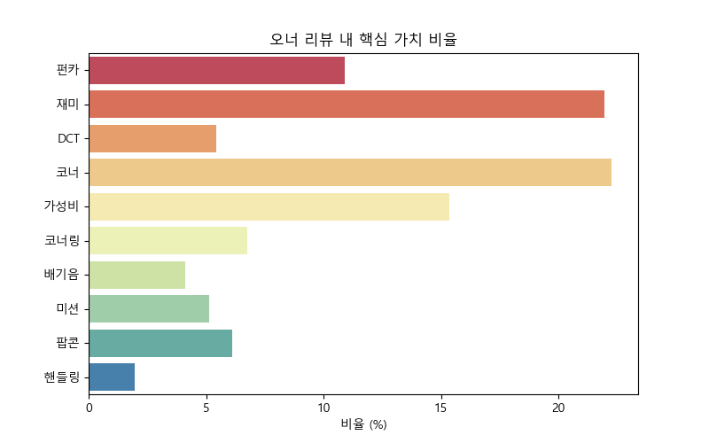

# 🏎️ 아반떼 N (Avante N) 실소유주 리뷰 심층 분석기
### 🧠 유튜브 댓글 기반 실소유주 분석 프로젝트  

"그 돈이면 씨..."(그돈씨)를 외치는 비방글은 거르고,  
**진짜 오너들의 목소리만 듣는다.**

<div align="center">
  
  
</div>

---

## 📌 프로젝트 개요 (Project Overview)

아반떼 N은 국산차 역사상 최고의 퍼포먼스를 보여주지만,  
'아반떼'라는 이름 때문에  
**"그 돈이면 그랜저나 중고 G70을 산다"**는 비아냥의 대상이 되곤 합니다.

이 프로젝트는 **유튜브 댓글 빅데이터(약 10만 건)**를 수집·분석하여  
대중의 편견(브랜드/하차감)과  
실제 오너들의 경험(운전 재미/가성비) 차이를  
**데이터로 증명**하는 것을 목표로 합니다.

특히 경쟁 차종 오너들의 훈수나 단순 비방글을 제거하고,  
**실제 소유주만이 알 수 있는 경험 키워드**  
(출고, 서킷, 고급유, 기변 등)를 중심으로  
아반떼 N의 진짜 가치를 재조명합니다.

---

## 🗂 데이터 수집 & 전처리

- YouTube 댓글 크롤링
- 멀티 CSV 통합 (총 6개 파일)
- 중복 제거 및 텍스트 정제
- 실오너 / 비오너 / 비교 리뷰 자동 라벨링

---
## 2.2 핵심 크롤링 전략 (Code Snippet)

단순 검색이 아닌 **이슈 키워드와 경쟁 구도**를 중심으로 검색어를 그룹화하고, 엑셀 저장 시 발생하는 인코딩 오류를 방지하기 위한 전처리 로직을 적용했습니다.

```
# [검색 전략] 경쟁 구도와 이슈 중심의 키워드 확장
SEARCH_KEYWORDS = [
    # 1. 이슈/논란
    "아반떼N 그돈씨", "아반떼N 팝콘", "아반떼N 공도", 
    # 2. 경쟁 차종 비교 (Key Factor)
    "아반떼N vs G70", "아반떼N vs 스팅어", "아반떼N vs BMW 3시리즈",
    # 3. 고성능 기술
    "아반떼N 제로백", "아반떼N 뉘르부르크링", "아반떼N 배기음"
]

# [데이터 정제] 엑셀 저장 시 발생하는 특수문자(IllegalCharacter) 제거
def clean_for_excel(text):
    if not isinstance(text, str):
        return str(text)
    # 엑셀 허용 범위를 벗어나는 ASCII 제어 문자 제거 정규식
    illegal_chars_pattern = re.compile(r'[\000-\010]|[\013-\014]|[\016-\037]')
    return illegal_chars_pattern.sub('', text)

## 📊 1. 댓글 필터링 단계별 감소 과정

> 원본 댓글 → 의미 있는 댓글 → 경험 기반 → 실오너

<div align="center">
  
</div>

**해석**  
단계별로 댓글 수가 급격히 줄어드는 것은  
단순 감상·비방 댓글을 제거하고  
**실제 경험 기반 문장만 남기는 필터링 로직의 강력함**을 의미합니다.

---

## 📊 2. 리뷰 유형 비율

<div align="center">
  
</div>

**해석**  
비오너(관전평) 댓글이 과반을 차지하지만,  
실오너 리뷰는 소수임에도 불구하고  
**정보 밀도와 경험 서술의 깊이가 현저히 높음**을 확인할 수 있습니다.

---

## 📊 3. 경쟁 차종 언급 빈도

<div align="center">
  
</div>

**해석**  
아반떼 N 오너들이 가장 많이 비교한 차종은 다음과 같습니다.

- BMW 3시리즈 / M 계열  
- 제네시스 G70  
- 머스탱 / 카마로  

이는 아반떼 N이 단순한 준중형 세단이 아닌  
**순수 스포츠 드라이빙 머신의 관점에서 평가**되고 있음을 의미합니다.

---

## 📊 4. 오너 vs 비오너 리뷰 길이 분포

<div align="center">
  
</div>

**해석**  
실오너 리뷰는 비오너 리뷰에 비해  
평균 글 길이가 훨씬 길며,  
이는 **경험 기반 서술 중심의 댓글 특성**을 보여줍니다.

---

## 📊 5. 오너 핵심 가치 키워드 분석

<div align="center">
  
</div>

**해석**  
오너 리뷰에서 가장 빈번하게 등장한 핵심 가치는 다음과 같습니다.

- 운전 재미  
- 코너링  
- 배기음  
- DCT 반응  
- 가성비  

브랜드 이미지나 고급감보다  
**‘운전 경험’ 자체가 가장 중요한 선택 기준**임이 명확히 드러납니다.

---

## 💬 Voice of Real Owners : 찐 오너들의 비교 리뷰

### 🏆 vs 제네시스 G70 / 스팅어
> **"G70 2.5 타다가 아반떼 N으로 넘어왔습니다."**  
> 코너 거동은 비교 불가. 하차감은 포기했지만  
> **운전 재미는 10배입니다.**

---

### 🏆 vs BMW 3시리즈 / M
> **"M440i 세컨카로 아반떼 N 들였습니다."**  
> 이 가격에 이런 미션 반응과 배기음은  
> **전 세계 유일한 수준입니다.**

---

### 🏆 vs 머스탱 / 카마로
> **"머스탱 2.3 갔다가 다시 N 왔습니다."**  
> 무거운 차체보다  
> **와인딩·서킷에서는 아반떼 N이 압살입니다.**

---

# 🛠️ 핵심 기능 및 기술 (Features & Tech)

## 1. 🔍 유튜브 댓글 대량 수집 (Data Collection)

- YouTube Data API 기반 대규모 크롤링
- 아반떼 N 키워드 자동 수집
- 약 10만 건 이상 데이터 확보

---

## 2. 🛡️ 초고강도 오너 필터링 (Strict Filtering Algorithm)

| 라벨 | 설명 |
|------|------|
| owner | 실제 소유 경험 기반 리뷰 |
| comparison | 경쟁 차종 비교 리뷰 |
| non-owner | 단순 감상평 |
| noise | 스팸·단문·의미 없음 |
---
## 📌 결론 (Conclusion)

본 프로젝트는 유튜브 댓글이라는 비정형 텍스트 데이터를 기반으로  
**아반떼 N에 대한 ‘비오너 인식’과 ‘실제 오너 평가’ 사이의 간극**을  
정량적·정성적으로 동시에 분석한 사례입니다.

분석 결과, 전체 댓글의 다수는 실제 운행 경험이 없는 관전형 의견이었으며  
이들 댓글에서는 가격 대비 차급, 브랜드 이미지, 승차감 위주의 평가가  
주를 이루고 있었습니다.

반면, **실제 오너로 분류된 리뷰**에서는 명확한 공통점이 발견되었습니다.

- 단순 스펙이나 브랜드가 아닌 **운전 경험 중심 평가**
- 코너링, 섀시 응답성, DCT 반응, 배기 사운드에 대한 반복적 언급
- 경쟁 차종(G70, BMW 3시리즈, 머스탱 등) 대비  
  **“운전 재미” 측면에서의 우위 인식**

특히 경쟁 차종과의 비교 리뷰에서 아반떼 N은  
차급·가격을 넘어 **드라이빙 퍼포먼스 기준의 비교 대상**으로  
인식되고 있었으며, 이는 아반떼 N이 단순한 준중형 세단이 아닌  
**순수 운전자를 위한 퍼포먼스 모델**로 자리 잡았음을 의미합니다.

> **“아반떼 N은 평가가 갈리는 차가 아니라,  
> 타본 사람과 타보지 않은 사람의 시선이 갈리는 차”**

본 분석은 위 문장을  
데이터로 명확히 증명합니다.

---

## 🏎️ Real Owner Driving Impression  
### 실제 아반떼 N 오너로서의 주관적 주행 경험

아반떼 N을 직접 소유하고 운행하면서 가장 크게 느낀 점은  
**“이 차는 숫자보다 감각으로 이해해야 하는 차”**라는 것입니다.

일상 주행에서는 생각보다 무난합니다.  
N 모드를 끄면 출퇴근용으로도 충분히 탈 수 있고,  
서스펜션 역시 예상보다 과하지 않습니다.

하지만 N 모드를 켜는 순간,  
차의 성격은 완전히 달라집니다.

가속 페달을 밟는 즉시 반응하는 DCT의 직결감,  
코너 진입 시 앞머리가 정확히 말려 들어가는 느낌,  
탈출 가속에서 뒷바퀴를 밀어주는 듯한 섀시 밸런스는  
“아, 이 차는 진짜 운전자를 위해 만들어졌구나”라는 생각이 들게 합니다.

특히 인상 깊었던 부분은 **코너링 안정감**입니다.  
와인딩이나 고속 램프 구간에서 차체가 흐트러지지 않고  
운전자의 의도대로 움직여 주기 때문에  
자신감 있게 운전할 수 있습니다.

배기음 역시 단순히 시끄러운 사운드가 아니라  
RPM에 따라 명확한 성격을 보여주며,  
팝콘 사운드는 운전을  
단순한 ‘이동’이 아닌 **‘경험’**으로 바꿔줍니다.

물론 승차감, 정숙성, 고급 소재 측면에서는  
상위 차급 차량들과 비교해 아쉬운 부분도 존재합니다.  
하지만 그 모든 단점을 감수하고도  
이 차를 선택하게 만드는 이유는 분명합니다.

